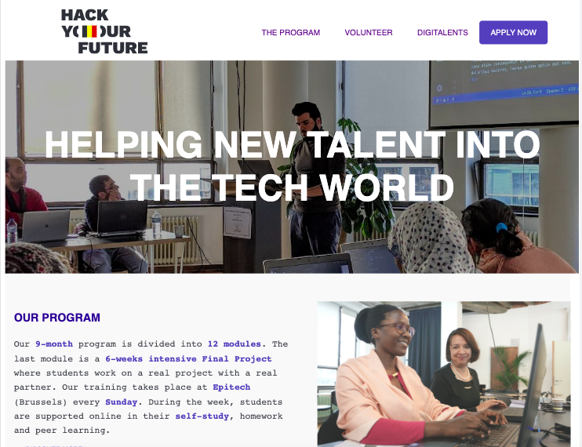

# Hack Your Future website

> The Hack Your Future project involves reverse ingeniering and redesigning with
> the goal of improving its functionality, user experience, and visual appeal.\
> Hack Your Future shares the aim to enable refugees and disadvantaged people to
> build digital skills for a career in web development, facilitate the integration
> of newcomers, and address the shortage of qualified workforce in the IT sector.

## Table of contents

- [Hack Your Future website](#hack-your-future-website)
  - [Table of contents](#table-of-contents)
  - [General info](#general-info)
  - [Screenshots](#screenshots)
  - [Technologies](#technologies)
  - [Setup](#setup)
  - [Code Examples](#code-examples)
  - [Features](#features)
  - [Status](#status)
  - [Inspiration](#inspiration)
  - [Contact](#contact)
  - [Instructions for use](#instructions-for-use)
  - [Code Quality Checks](#code-quality-checks)
  - [Continuous Integration (CI)](#continuous-integration-ci)
  - [Repo Setup](#repo-setup)

## General info

> A website that helps people find their IT career, the main objective is to use
> reverse engineering to rebuild the HackYourFuture website applying the agile
> methodology

## Screenshots



## Technologies

- VSC code
- JavaScript
- HTML
- CSS
- GitHub

## Setup

- clone the repo
- npm install
- use `live server` to preview the website

## Code Examples

```HTML
 <header>
      <div class="navbar">
        <div class="navbar-logo">
          
        </div>
      </div>
  </header>
```

```CSS
 .navbar-logo {
  margin-left: 100px;
  display: flex;
  align-items: center;
}
```

```JS
function typing() {
  if (i < text.length) {
    document.getElementById("title").innerHTML += text.charAt(i);
    i++;
    setTimeout(typing, 140);
  }
}
typing();
```

## Features

List of features ready and Todos for future development

- Create extra pages for the "about", "support" and "FAQ" section
- Work in the backend of the donation section
- Make the contact form work

## Status

Project is: _Completed_

## Inspiration

Project by Hack Your Future organization

## Contact

By:

- [Cris](https://github.com/cristobal-lopez)
- [Inna](https://github.com/inna9Z)
- [Iryna](https://github.com/IrynaSobetska)
- [Jean Paul](https://github.com/iradukundajp)

## Instructions for use

<details>
  <summary>Getting Started</summary>

<!-- a guide to using this repository -->

1. `git clone git@github.com:HackYourFutureBelgium/template-markdown.git`
2. `cd template-markdown`
3. `npm install`

## Code Quality Checks

- `npm run format`: Makes sure all the code in this repository is well-formatted
  (looks good).
- `npm run lint:ls`: Checks to make sure all folder and file names match the
  repository conventions.
- `npm run lint:md`: Will lint all of the Markdown files in this repository.
- `npm run lint:css`: Will lint all of the CSS files in this repository.
- `npm run validate:html`: Validates all HTML files in your project.
- `npm run spell-check`: Goes through all the files in this repository looking
  for words it doesn't recognize. Just because it says something is a mistake
  doesn't mean it is! It doesn't know every word in the world. You can add new
  correct words to the [./.cspell.json](./.cspell.json) file so they won't cause
  an error.
- `npm run accessibility -- ./path/to/file.html`: Runs an accessibility analysis
  on all HTML files in the given path and writes the report to
  `/accessibility_report`

## Continuous Integration (CI)

When you open a PR to `main`/`master` in your repository, GitHub will
automatically do a linting check on the code in this repository, you can see
this in the[./.github/workflows/lint.yml](./.github/workflows/lint.yml) file.

If the linting fails, you will not be able to merge the PR. You can double check
that your code will pass before pushing by running the code quality scripts
locally.

## Repo Setup

- Give each member **_write_** access to the repo (if it's a group project)
- Turn on GitHub Pages and put a link to your website in the repo's description
- Turn on GitHub Actions
- In _General_ Section > check **Discussions**
- In the _Branches_ section of your repo's settings make sure the
  `master`/`main` branch must:
  - "_Require a pull request before merging_"
  - "_Require approvals_"
  - "_Dismiss stale pull request approvals when new commits are pushed_"
  - "_Require status checks to pass before merging_"
  - "_Require branches to be up to date before merging_"
  - "_Do not allow bypassing the above settings_"

</details>
